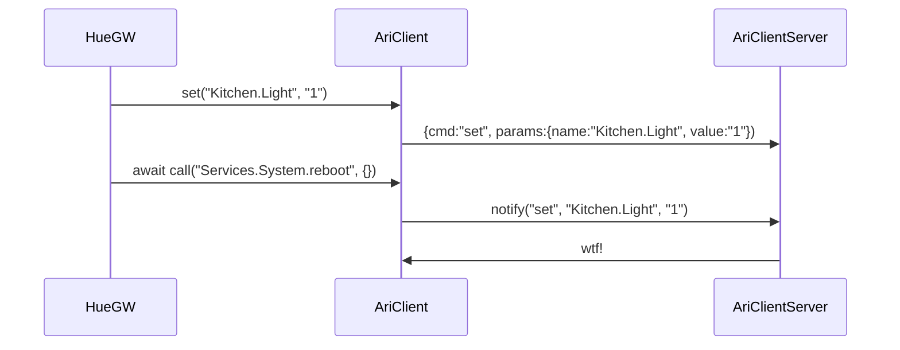
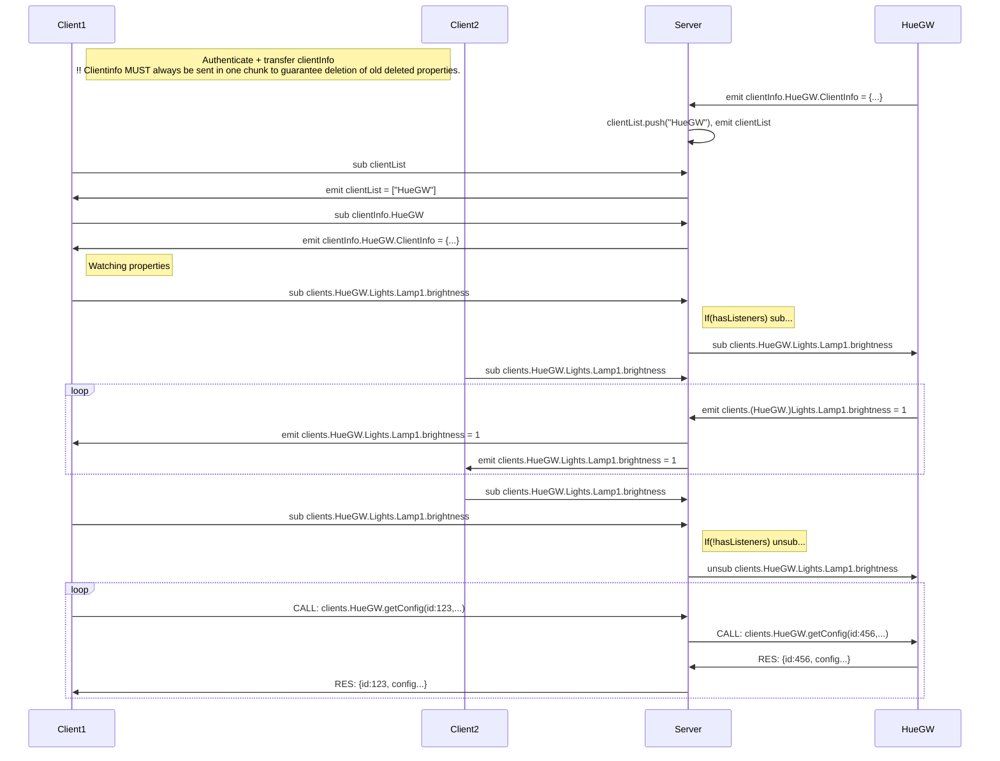

# Server - non-coherent ramblings ;O)
## ARI Object Model

    Structure:                  Types:              Description (from type):
    ----------------------------------------------------------------------------------------
    services
      HueGW                     HueGW               Philips Hue gateway service.
        Lights                                      Lights group
          Lamp1                 HueGWLamp           Light device
            ins
              brightness                            Brighness setpoint from 0-1.
            outs
              reachable                             Indicates whether the light is reachable by the gateway.
      Player                    Player
        ins
          command                                   Enum: play, stop, play/pause, next, previous, ff, fr
        outs
          state                                     Enum: playing, stopped, seeking

## Events:
* MetaEvents generated when any listeners are added and removed
    * addedListener
    * removedListener

* AriOutput events
    * set: 
        * When a value iof an output is set by the owning object.

* AriObject events
    * modelUpdated: 
        * When an object was has a child. Eiether Input, output, function or child object.

# Clients
## Model

Use case could be for a client to access members swriting something like this:

    HueGW.Lights.LivingroomTvLamp.brightness = 100;
    var hueConfig = await HueGW.getConfig();

    //----------------------
    /*
        function    >|list(x) ---|>
        ioValue     >|volume ----|>
        iValue      >|command    |
        oValue       |      state|>
    */

## Communication

# Message model for ARI: 

    ->server: {auth: {token: "jhgjhgguh"}}
    <-server: {authOk: {name: "WebClient(1)"}}
    
    ARI.BootTime = {ts:Z20180219112800123} 
    {cmd:"set", pars:{name:"ARI.BootTime", val: {ts:Z20180219112800123} } }
    ARI.Time = {v:"123000"} 
    ARI.services = {v:["HueGW"], ts:Z20180219112800123} 

    Service.HueGW.clientInfo = {v:"clientInfo", ts:Z20180219112800123} 
    Service.HueGW.connected = {v:"2", ts:Z20180219112800123} 

    Service.HueGW.Lights.Lamp1.brightness.out = {v:0.5, ts:Z20180219112800123} 
    Service.HueGW.Lights.Lamp1.brightness.in = {v:0.5, ts:Z20180219112800123} 

    Service.HueGW.getConfig.call = {req:123, pars:{...}} 
    Service.HueGW.getConfig.reply = {res:123, result:{...}} 

    Service.AriLogger.getLog.call = {req:123, pars:{parameterName:, startTime?, endTime?:, reolution?:}} 
    Service.AriAliaser.getList.call = {req:123, pars:{parameterName:, startTime?, endTime?:, reolution?:}} 
    Service.AriAliaser.setAlias.call = {req:123, pars:{x:y, z:w}} 

    {cmd:"sub", name:"Service.HueGW.Lights.Lamp1.brightness.out" }
    {cmd:"evt", name:"Service.HueGW.Lights.Lamp1.brightness.out", val:{v:0.5, ts:Z20180219112800123} }
    {cmd:"req", name:"Service.HueGW.getConfig.call",  data: {reqId: 123, pars: {...}} }
    {cmd:"res", name:"Service.HueGW.getConfig.reply", data: {reqId: 123, result:{...}} } 

# Dataflow

Model on Server

    clientList: [HueGW, ++]
    clientInfo.HueGW: {description: ...}
    
    clientConfig.HueGW: {...}
    
    value.HueGW.[...]: value

    function.HueGW.getConfig({req:123, pars: ...})
    response.HueGW.getConfig({res:123, result: ...})
