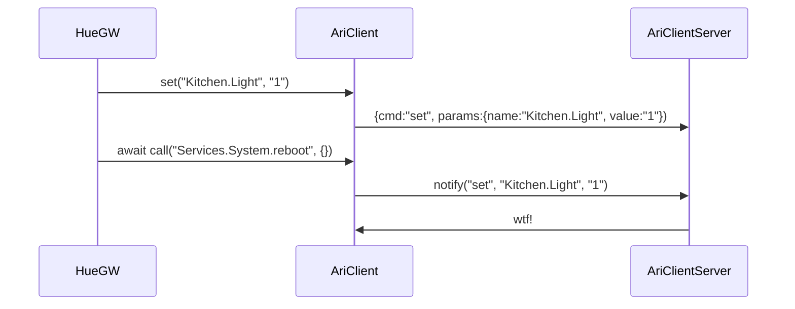
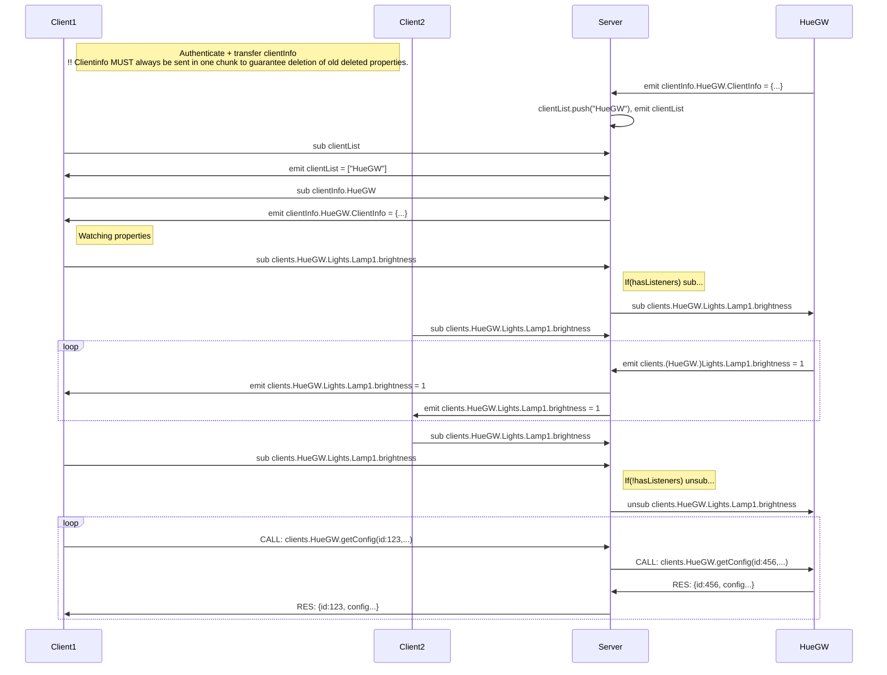

# Server - non-coherent ramblings ;O)
## ARI Object Model

    Structure:                  Types:              Description (from type):
    ----------------------------------------------------------------------------------------
    Clients
      HueGW                     HueGW               Philips Hue gateway service.
        Lights                                      Lights group
          Lamp1                 HueGWLamp           Light device
            ins
              brightness                            Brighness setpoint from 0-1.
            outs
              reachable                             Indicates whether the light is reachable by the gateway.
      Player                    Player
        ins
          command                                   Enum: play, stop, play/pause, next, previous, ff, fr
        outs
          state                                     Enum: playing, stopped, seeking
      MysGW
        LivingroomPir
          outs
            motion
            batteryLevel
      Flow
        Main
          Office
            Light
              Motion
              Bulb1
              Bulb2
              Bulb3
              Bulb4
              Delay
              
      webClient                                     Note: Browser connected to server! Satate will not be stored if no clientInfo was sent.
      webClient(1)
      webClient(2)
      ...

## Events:
* MetaEvents generated when any listeners are added and removed
    * addedListener
    * removedListener

* AriOutput events
    * set: 
        * When a value iof an output is set by the owning object.

* AriObject events
    * modelUpdated: 
        * When an object was has a child. Eiether Input, output, function or child object.

# Clients
## Model

Use case could be for a client to access members swriting something like this:

    HueGW.Lights.LivingroomTvLamp.brightness = 100;
    var hueConfig = await HueGW.getConfig();

    //----------------------
    /*
        function    >|list(x) ---|>
        ioValue     >|volume ----|>
        iValue      >|command    |
        oValue       |      state|>
    */

## Communication

Client1: (HueGW)
AriRoot
    Clients
        HueGW
            Lights
                Lamp1
                    ins
                        brightness
                    outs
                        reachable

Client 2: (MysGW)
AriRoot
    Clients
        MysGW
            LivingroomPir
                outs
                    motion
                    batteryLevel

Client 3: (Flow)
AriRoot
    Clients
        Flow
            ...
ari.on("out", "Clients.MysGW.LivingroomPir.outs.motion", (n,v)=>{
    ari.emit("set", "Clients.HuwGW.Lights.Lamp1.brightness", 0.5);
});
source for up-stream events?
target for down-stream events?
... to distiguish between events from or to sub-tree... (Stop bubbling if target? ("set" or "flash" event wouldn't need bubbling ... on the other hand if you wan tto sub to any input being set - you'd need the bubbling. - Still use target/source...

Subscriptions: (out)
    Flow subscribes to "out" events from "Clients.MysGW.LivingroomPir.outs.motion".
    A "listenerAdded" event is bubbled to "Clients.Flow" intercepted by the AriClient instance.
    The client subscribes to the "out" events from "Clients.MysGW.LivingroomPir.outs.motion" on the server.
    The server finds, or creates the structure for the event and (since it's an "out" subscription), sends the last stored "out" telegram to the "Flow" client.
    The "Flow" client received a "out" event for "Clients.MysGW.LivingroomPir.outs.motion" and emits this event.
    The callback function for this event is now called.
Calls:
    ClientX.x.y.z emit("call", "Clients.ClientY.getPlus1", 41).
    "call" was subscribed by the AriClient for ClientY. A callback is called sending the event to the server.
    Server findsOrCreates event path and emit the event.
     Subscribing AriClient for ClientY is called and forwwards the event to it's local event tree. 
    The event is intercapted by the function handler (callback) and the return value is emitted via this.emit("return", 41+1=42) - (source=this)

emit("out", 42); -> event has source added (=this) (will be resolved to path before sending to server)
emit("call", "path", args); -> event has "target" added = "path"

# Message model for ARI systems: 

    ->server: {cdm:"auth", name: "WebClient", token: "42"}
    <-server: {cmd:"authOk", name: "WebClient(1)", token: "42"}

    ->server: cmd:"on"

## Client local message model:
    local.** is used for local events
    remoteClientName.** is used for remote clients events

## Server message model:
    clientName.** is used for all events

## client subscribes to remote event:
    @ Client    on(newListener, (name)=>{server.send(cmd:on, name, name)});
    @ Client    ari.on("remoteClientName.**", ()=>{...});
    @ server    

# Use cases
## motion -> flow -> lamp
    
    flow.on("MotionSensor.motion.out", (val)=>{flow.emit("Lamp.brightness.set", 1)});
        @ Flow:     on "MotionSensor.motion.out" send "Lamp.brightness.set" = 1
        @ Flow:     ->server: { cmd: on, name: "Motion.motion.out" }
        @ Server:   on "Motion.motion.out" send to Flow
        @ Server:   ->Motion: { cmd: on, name: "motion.out" }}
        @ Motion:   on "_.motion.out" send to Server
    
    lamp.onLocal("brightness.set", (val)=>{brigtness = val;});
    
    motion.emit("motion.out", 1);
        @ Motion:   emit("_.motion.out", 1)
        @ Motion:   ->Server: {cmd: evt, name: "Motion.motion.out", 1}
        @ Server:   ->Flow: {cmd: evt, name: "Motion.motion.out", 1}
        @ Flow:     ->Server: {cmd: evt, name: "Lamp.brightness.set", 1}
        @ Server:   ->Lamp: {cmd: evt, name: "Lamp.brightness.set", 1}
        @ Lamp:     Set brightness

## All outputs -> Web
    
    web.on("**.out", ...});
        @ Web:      ->server: { cmd: on, name: "**.out" }
        @ Server:   on "Motion.motion.out" send to Flow
        @ Server:   ->Motion: { cmd: on, name: "motion.out" }}
        @ Motion:   on "_.motion.out" send to Server
    
    lamp.onLocal("brightness.set", (val)=>{brigtness = val;});
    
    motion.emit("motion.out", 1);
        @ Motion:   emit("_.motion.out", 1)
        @ Motion:   ->Server: {cmd: evt, name: "Motion.motion.out", 1}
        @ Server:   ->Flow: {cmd: evt, name: "Motion.motion.out", 1}
        @ Flow:     ->Server: {cmd: evt, name: "Lamp.brightness.set", 1}
        @ Server:   ->Lamp: {cmd: evt, name: "Lamp.brightness.set", 1}
        @ Lamp:     Set brightness

# Dataflow

Model on Server

    clientList: [HueGW, ++]
    clientInfo.HueGW: {description: ...}
    
    clientConfig.HueGW: {...}
    
    value.HueGW.[...]: value

    function.HueGW.getConfig({req:123, pars: ...})
    response.HueGW.getConfig({res:123, result: ...})
