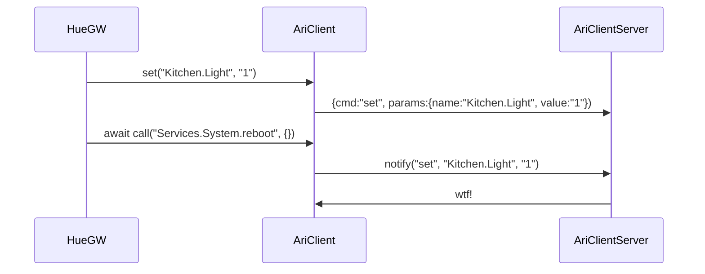
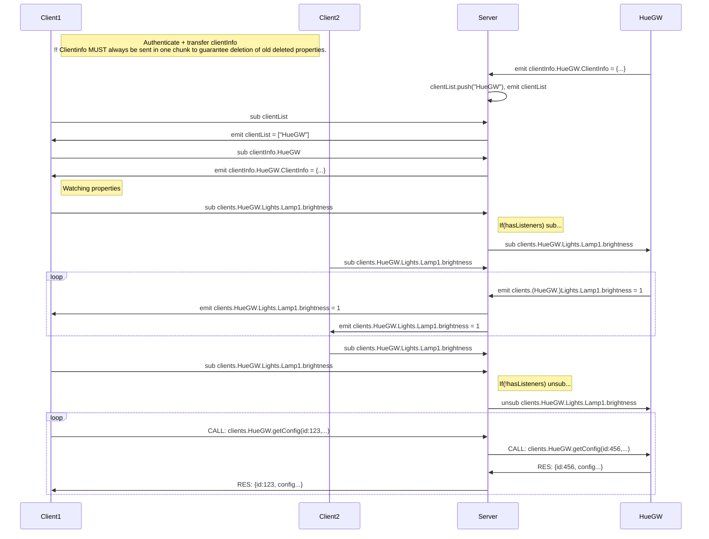

# Server - non-coherent ramblings ;O)
## ARI Object Model
    {
        services: {
            "HueGW": { clientModel from the HueGW },
            ...
        }
    }

# Clients
## Model
Client/service is modelled in the system like a "normal javascript object" model with attributes prefixed with an "_" (underscore).

    var clientModel = {
        _type: "Object",
        _name: "HueGW",
        _description: "Philips HUE gateway.",
        "getConfig": {
            _type: "Function",
            _description: "\
                Returns the current configuration of the HueGW \
                @param {number} a \
                @param {number} b \
                @returns {number}"
        },
        "setConfig": {
            _type: "Function",
            _description: "Set current configuration of the HueGW."
        },
        "Lights": {
            _type: "Object",
            _description: "Lights group!",
            "LivingroomTvLamp": {
                _type: "Object",
                _description: "Lights group!",
                "brightness": {
                    _type: "ioNumber",
                    _unit: "%",
                    _description: "Current state of the light. (1=On, 0=Off)"
                    _value: "1"
                }
            }
        },
        "Sensors": {
            _type: "Object",
            _description: "Sensor group!"
        }
    };

Now the use case could be for a client to access members swriting something like this:

    HueGW.Lights.LivingroomTvLamp.brightness = 100;
    var hueConfig = await HueGW.getConfig();

    //----------------------
    /*
        function    >|list(x) ---|>
        ioValue     >|volume ----|>
        iValue      >|command    |
        oValue       |      state|>
    */

EventModel

    HueGW subscribes to HueGW.**

    Server: HueGW.Lights.Lamp1.brightness, OUTPUT --> Output was set
    HueGW.Lights.Lamp1.brightness, SUB -->  Send updates for this property
    HueGW.Lights.Lamp1.brightness, UNSUB -->  Send updates for this property

## Communication
AriClient has methods:
    
    connect();
    setClientInfo(clientInfo: ClientModel);
    
    set(memberPath: string, value, Any);
    get(memberPath: string);
    watch(memberPath: string, callback: Funtion);
    unWatch(memberPath: string, callback: Funtion);
    
    call(memberPath: string, parameter: Any, callback: Funtion);

## Client Object Model and Proxying
### Usage 
    var c = new AriClientComponent(clientName, state.authToken, "device");
    c.description = "blah blah";

    // Define inputs and handlers.
    c.ins.add("in1", {type: "string", description:"Descr"}, (data) => {
        c.outs.out1 = c.ins.in1;
    }, (event) => {});
    
    c.ins.in1.on("connect" ()=>{ /* do stuff */ });
    c.ins.in1.on("disconnect" ()=>{ /* do stuff */ });
    
    // Define outputs
    c.outs.add("out1", {type: "string", description:"Descr"});

    // Handle events.
    c.on("connect", (result) => {
    });

    // Define functions and handlers.
    c.functions.add("func1", {returntype: "string", description:"Descr", params:[{name:"param1", description:"blah"}]}, (params) => {
        return "Always 42!";
    };

    class me {
        constructor(){}
        in1: string;
        in1.description = "";
        func1 () {

        }
    }

# Message model for ARI: 

    ->server: {auth: {token: "jhgjhgguh"}}
    <-server: {authOk: {name: "WebClient(1)"}}
    
    ARI.BootTime = {ts:Z20180219112800123} 
    {cmd:"set", pars:{name:"ARI.BootTime", val: {ts:Z20180219112800123} } }
    ARI.Time = {v:"123000"} 
    ARI.services = {v:["HueGW"], ts:Z20180219112800123} 

    Service.HueGW.clientInfo = {v:"clientInfo", ts:Z20180219112800123} 
    Service.HueGW.connected = {v:"2", ts:Z20180219112800123} 

    Service.HueGW.Lights.Lamp1.brightness.out = {v:0.5, ts:Z20180219112800123} 
    Service.HueGW.Lights.Lamp1.brightness.in = {v:0.5, ts:Z20180219112800123} 

    Service.HueGW.getConfig.call = {req:123, pars:{...}} 
    Service.HueGW.getConfig.reply = {res:123, result:{...}} 

    Service.AriLogger.getLog.call = {req:123, pars:{parameterName:, startTime?, endTime?:, reolution?:}} 
    Service.AriAliaser.getList.call = {req:123, pars:{parameterName:, startTime?, endTime?:, reolution?:}} 
    Service.AriAliaser.setAlias.call = {req:123, pars:{x:y, z:w}} 

    {cmd:"sub", name:"Service.HueGW.Lights.Lamp1.brightness.out" }
    {cmd:"evt", name:"Service.HueGW.Lights.Lamp1.brightness.out", val:{v:0.5, ts:Z20180219112800123} }
    {cmd:"req", name:"Service.HueGW.getConfig.call",  data: {reqId: 123, pars: {...}} }
    {cmd:"res", name:"Service.HueGW.getConfig.reply", data: {reqId: 123, result:{...}} } 

# Dataflow

Model on Server

    clientList: [HueGW, ++]
    clientInfo.HueGW: {description: ...}
    
    clientConfig.HueGW: {...}
    
    value.HueGW.[...]: value

    function.HueGW.getConfig({req:123, pars: ...})
    response.HueGW.getConfig({res:123, result: ...})
