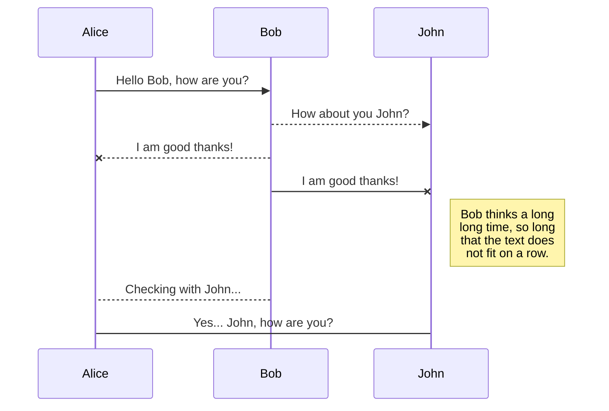
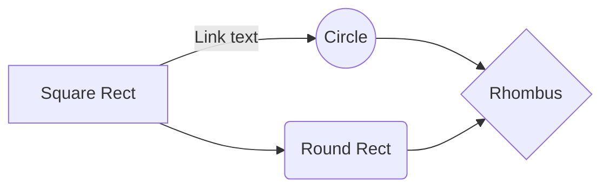

# Low level protocol:
JSON formatted messages are sent between server and clients.
{<req: Number,> cmd: string, pars: object}
{<res: Number,> cmd: string, pars: object}
req/res only present if the telegram represents a request (e.g. remote function call)
req/res not present if the telegram represents a notification without any return value (e.g. set parameter, etc.)
Telegram with res member is a response to a request done where the req value. The res value will correspont to the sent req value.

## Message types (e.g. "cmd" string)

* CONNECT 
* ...In case no previous authentication has taken place, this messsage is sent from the client to the server after connection has been established.
Params = {userName: string, password: string}
If username and password are OK - AND the user has approived the client either automatically or manually - a AUTHTOKEN is returned to the client. This token should be stored on the client and used on consecutiove connections to the server from this client.

### REQAUTHTOKEN

### AUTHTOKEN
A token that uniquely identifies the client.
(In case more than one client with the same name is authenticated and approved, a new name for the client is embedded in the token. This allows multiple connections from the same client type.)

### GETCLIENTINFO
### CLIENTINFO
SetClientInfo must be used as opposed to something like SetMemberInfo, since this will make it easier to remove some members and still keep state information for remaining members on the server.
Sending a full client info ensure coherence.
Merging + update on server will identify new or removed members and clean up server state accordingly.

	ClientInfo = {name, type, description, value, more attributes...} {name} to clear!
		type can be:
			iNumber, oNumber, ioNumber,
			iString, oString, ioString,
			Function,
			Object

### SETCLIENTINFO

### SUBSCRIBE

### PUBLISH

### VALUE
The message is sent as a response to a change in a value on ethe server that has been subscribed for.

### UNSUBSCRIBE

### GETLAST
	Can be used on input variables or output variables to get the last state sent to the server.

### CALLFUNCTION

# TEST
mermaid in Visual studio...

And this will produce a flow chart:

